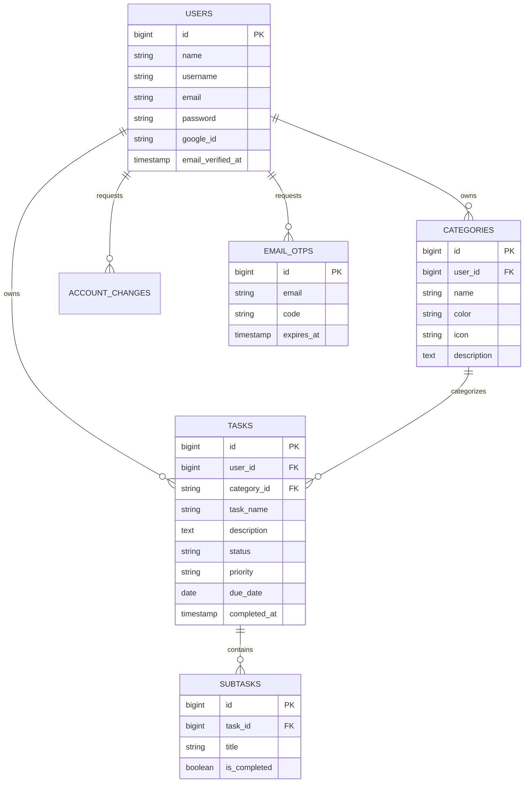

# Personal Task Manager

**Project Code:** WST21-PM-2026-SF  
**Student Name:** Christian Romano  
**Course & Year:** BSIT - 2nd Year (Section 11)  
**Database Used:** Supabase (PostgreSQL) / MySQL

---

## Core Features

- **Add Task:** Create new tasks with title, description, dynamic category, priority level (Low, Medium, High, Urgent), due date, and dynamic subtasks checklist.
- **View Tasks:** Multiple task viewing options including:
    - **All Tasks List:** Searchable and filterable task list with progress indicators.
    - **Task Details View (`tasks/{id}`):** Dedicated workspace view with interactive subtask checklist, status switcher, codeblock notes, and timing metadata.
    - **Task Board (Kanban):** 3-column workflow board (Pending, In Progress, Completed).
    - **Interactive Calendar:** Monthly calendar displaying deadlines with color-coded priority pills.
    - **Overview Dashboard:** 6 real-time stat cards, focus workload metrics, and category distributions.
- **Edit Task:** Modify task titles, descriptions, categories, due dates, and priorities with pre-filled forms.
- **Delete Task:** One-click task removal with confirmation prompts.
- **Update Status:** Instant status toggles (Pending, In Progress, Completed) directly from dashboard, lists, board, or detail views.

---

## Additional Enhanced Features

1. **Passwordless Authentication & Google OAuth:**
    - Sign in or register via temporary 6-digit email OTP codes (zero passwords needed).
    - Instant 1-click test login via Google OAuth integration.
2. **Subtasks Management:**
    - Break tasks into actionable steps with real-time percentage progress bars (0% - 100%).
3. **Categories & Organization:**
    - Organize tasks by custom color-coded categories with clean icon badges.
    - Dynamic inline category creation directly within task forms.
4. **Search & Multi-Filter:**
    - Real-time search across task titles and descriptions.
    - Multi-filtering by Status, Priority, Category, and Timeframe (Due Today, Overdue, Upcoming).
5. **Cloud Database (Supabase PostgreSQL):**
    - High-performance, cloud-hosted PostgreSQL database powered by Supabase with connection pooling.

---

## Database Architecture (ERD)



---

## Demo Login Credentials

The Supabase database comes pre-seeded with sample data:

| Field              | Demo Account                                               |
| ------------------ | ---------------------------------------------------------- |
| **Email**          | `christian.romano@example.com`                             |
| **Username**       | `christian_romano`                                         |
| **Password**       | `password123`                                              |
| **Google Sign-In** | Click **"Continue with Google"** for instant 1-click login |

---

## Installation & Setup Guide

### 1. Clone & Install Dependencies

```bash
git clone <repository-url>
cd mytaskmanager
composer install
```

### 2. Environment Configuration

Copy `.env.example` to `.env` and configure your database settings:

```env
DB_CONNECTION=pgsql
DB_HOST=aws-0-ap-northeast-1.pooler.supabase.com
DB_PORT=6543
DB_DATABASE=postgres
DB_USERNAME=postgres.bcjyckscprlvhjskzjdl
DB_PASSWORD=your_supabase_password
DB_SSLMODE=require
```

### 3. Generate Application Key & Run Migrations

```bash
php artisan key:generate
php artisan migrate
php artisan db:seed
```

### 4. Start Development Server

```bash
php artisan serve
```

Open your browser and visit: `http://127.0.0.1:8000`

---

## Route Map

| Method   | URI                    | Controller Action                | Description                           |
| -------- | ---------------------- | -------------------------------- | ------------------------------------- |
| `GET`    | `/login`               | `AuthController@showLogin`       | Passwordless / OAuth login view       |
| `POST`   | `/login/send`          | `AuthController@sendOtp`         | Send 6-digit magic code to email      |
| `GET`    | `/verify`              | `AuthController@showVerify`      | Verification input view               |
| `POST`   | `/verify`              | `AuthController@verifyOtp`       | Authenticate code & log in            |
| `GET`    | `/dashboard`           | `TaskController@dashboard`       | 6-metric stats dashboard              |
| `GET`    | `/tasks`               | `TaskController@index`           | Searchable & filterable task list     |
| `GET`    | `/tasks/create`        | `TaskController@create`          | Create new task form                  |
| `POST`   | `/tasks`               | `TaskController@store`           | Store task in database                |
| `GET`    | `/tasks/{task}`        | `TaskController@show`            | Detailed task workspace & subtasks    |
| `GET`    | `/tasks/{task}/edit`   | `TaskController@edit`            | Edit task form                        |
| `PUT`    | `/tasks/{task}`        | `TaskController@update`          | Update existing task                  |
| `DELETE` | `/tasks/{task}`        | `TaskController@destroy`         | Delete task                           |
| `PATCH`  | `/tasks/{task}/status` | `TaskController@updateStatus`    | Toggle task status                    |
| `GET`    | `/board`               | `TaskController@board`           | Kanban workflow column board          |
| `GET`    | `/calendar`            | `TaskController@calendar`        | Monthly interactive deadline calendar |
| `GET`    | `/categories`          | `CategoryController@index`       | Manage categories                     |
| `GET`    | `/settings/account`    | `AccountSettingsController@show` | Account profile & settings            |

---

## License

This project was developed for the **WST21 - Web Systems and Technologies** course curriculum.
